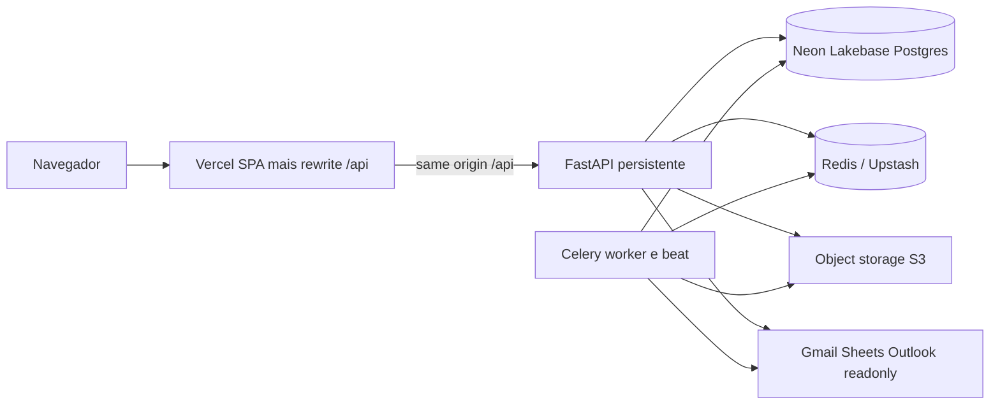
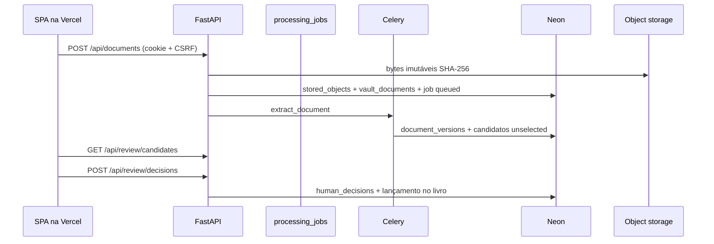
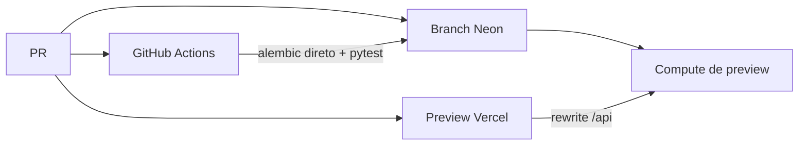

# Arquitetura alvo: Vercel + Neon

Documento de decisão para o produto de inteligência financeira privada
neste repositório. Não é um plano de reescrita. A stack de aplicação
permanece FastAPI + React/Vite + Celery.

## Decisão

A arquitetura ideal **não** é “o app inteiro na Vercel” nem “Neon como
backend”. É um híbrido de três planos:

1. **Vercel** — só a SPA (Vite/React) e o rewrite same-origin de `/api`.
2. **Neon (Lakebase Postgres)** — banco de produção e branches de preview.
   Object Storage S3-compatível para o cofre, quando o operador aceitar o
   estágio beta / a região `us-east-2`.
3. **Compute persistente** (Fly.io, Render, Railway ou o Helm já existente)
   — API FastAPI, worker Celery, beat, e Redis (ou Upstash Redis como
   serviço gerenciado).

Essa partição é a única que preserva os invariantes já no código:
revisão humana antes do livro, jobs com tabela canônica, originais
imutáveis, cookies CSRF, `/api/ready` (Postgres + Redis + storage) e
parsers/OCR em Python.

Rejeitado como arquitetura alvo:

- Reescrever em Next.js para “caber na Vercel”.
- Colocar FastAPI como função serverless da Vercel.
- Trocar o auth atual pelo Neon Auth (Better Auth).
- Usar Vercel Cron no lugar do Celery.
- Disco local (`STORAGE_PROVIDER=local`) em produção na nuvem.

## Evidência da stack atual

Verificado neste tree:

| Peça | Onde está hoje |
|---|---|
| SPA Vite/React | `frontend/`; nginx `proxy_pass` `/api/` localmente; `frontend/vercel.ts` no deploy Vercel |
| API | `uvicorn app.main:app` em `docker-compose.yml`; CORS = `FRONTEND_URL` |
| Pronto | `GET /api/ready` exige Postgres, Redis e storage |
| Jobs | Celery worker + beat; `processing_jobs` é a fonte da verdade |
| Tarefas | sync bancário, FX, recorrências, extração (`backend/app/tasks/`) |
| Auth | JWT + cookie httpOnly `session` + CSRF; TOTP; passkeys; Redis em 2FA/passkey |
| Cofre | `STORAGE_PROVIDER` `local` ou `s3` (`get_storage_provider`) |
| Vetores (agents) | `pgvector` (`046_agents_foundation.py`) |
| Deploy self-host | Compose + chart Helm (`charts/securo`) |

O frontend já assume **mesma origem** para `/api` (`axios` `baseURL: '/api'`,
CSP `connect-src 'self'`). Qualquer split de domínio quebra cookies e CSP
a menos que o rewrite da Vercel restaure a mesma origem.

## Topologia

Fluxo de um documento:

## O que cada plano faz

### Vercel (fronteira)

- Build estático de `frontend/` (`npm run build`).
- `vercel.ts` (Root Directory = `frontend`): SPA fallback + rewrite
  `/api/:path*` para `API_ORIGIN` (origin persistente do FastAPI).
  `vercel.json` estático não interpola o origin por ambiente.
- Preview deployments por PR, com `FRONTEND_URL` do preview.
- Domínio de produção customizado (não depender de `*.vercel.app` para
  OAuth nem para passkeys).
- **Não** hospeda uvicorn, Celery, Tesseract, volume de anexos, MCP.

Deploy automático para produção deve ficar **desligado** no projeto
privado (`PRIVATE_INSTANCE`). Preview pode ficar ligado. Promoção para
produção é explícita.

### Neon (dados)

- Postgres 16 compatível com Alembic e `asyncpg`.
- Extensão `pgvector` ligada no projeto (agents; inofensiva se a flag
  estiver off).
- **Dois connection strings:**
  - API e worker: pooled (`-pooler`) com SSL. Com `asyncpg`, desligar
    prepared statements no pooler ou usar o modo compatível do PgBouncer.
  - `alembic upgrade`, `pg_dump`, restore: endpoint **direto**.
- Branch por PR de backend/preview: copiar schema+dados de homologação,
  correr migrações, apontar `DATABASE_URL` do compute de preview.
- Scale-to-zero só em preview. Produção do livro financeiro: compute
  mínimo always-on, para não pagar cold start no `/api/ready` nem nas
  extrações.
- IP allow list na produção, se o compute tiver egress estável.

Object Storage Neon (S3-compatível) é o destino preferido do cofre
**quando** o operador aceitar beta e `us-east-2`. Até lá, S3/R2/MinIO
atrás da interface `STORAGE_PROVIDER=s3` já existente. Vercel Blob não é
o alvo: o código fala S3, não a API da Vercel.

Não usar Neon Auth. Users, TOTP, passkeys, OIDC e CSRF já existem.

Projeto Neon **deste operador** (Auth **não** ligado; senhas só no
console Neon / secrets do compute, nunca no git). Schema já em Alembic
`092`. Object Storage beta privado provisionado na mesma branch:

| Campo | Valor |
|---|---|
| Nome | `securo-personal-finance` |
| Project id | `rough-dream-93584716` |
| Org | `org-bold-band-58607849` |
| Região | `aws-us-east-2` |
| Postgres | 16 (`vector` 0.8.0) |
| Database | `securo` |
| Branch | `main` (`br-autumn-brook-b5clfx9c`) |
| Host direto | `ep-green-lab-b52gwozb.c-7.us-east-2.aws.neon.tech` |
| Host pooled | `ep-green-lab-b52gwozb-pooler.c-7.us-east-2.aws.neon.tech` |
| Bucket S3 | `securo-vault` (privado) |
| Endpoint S3 | `https://br-autumn-brook-b5clfx9c.storage.c-7.us-east-2.aws.neon.tech` |
| Access Key ID | `token_id` da credencial `securo-vault-api` (console Neon) |

Homologação nesta sessão: `/api/ready` = `ready` (Postgres Neon + Redis
local + S3 Neon); upload CSV → candidato `selected=false` → aprovação
posta 1 transação; download autenticado 200 / anónimo 401; plano de
renegociação com 1 dívida. Redis gerido e compute público (Fly/Render/
Railway/Helm) + SPA Vercel com `API_ORIGIN` ainda faltam para produção.

Os projetos `connector-command-center` e `kimi-memory` **não** são desta
aplicação; não reutilizar as strings deles.

Não usar Neon Functions como substituto do FastAPI neste ciclo: o app é
um processo ASGI com worker lado a lado, não um handler isolado. Functions
ficam como opção futura só para um sidecar de longa duração (SSE/MCP),
não para o livro.

### Compute persistente (plano de controle)

Um serviço (ou o chart Helm) que corre **juntos**:

- `alembic upgrade head` no boot (já é o comando do Compose)
- `uvicorn app.main:app`
- `celery -A app.worker worker`
- `celery -A app.worker beat`

Redis: Upstash (TLS, URL no `REDIS_URL`) ou Redis no mesmo provedor de
compute. Sem Redis, login 2FA/passkey, rate limit e o broker Celery
quebram; `/api/ready` fica `degraded`.

Região: o mais perto possível do Neon (hoje, se Object Storage/Functions
forem usados, `us-east-2`). A SPA na Vercel é global; a latência que
importa é API ↔ Postgres ↔ storage.

Tesseract, se OCR de imagem for requisito de produção, instala-se nesta
imagem — não na Vercel.

## Variáveis que mudam (sem mudar o modelo)

| Variável | Valor alvo |
|---|---|
| `FRONTEND_URL` | `https://<domínio-produção>` |
| `API_ORIGIN` | Origin persistente do FastAPI, sem barra final (env da Vercel) |
| `DATABASE_URL` | `postgresql+asyncpg://...-pooler...neon.tech/neondb?ssl=require` (API/worker) |
| `DATABASE_URL_DIRECT` | Endpoint Neon **direto** (Alembic, `pg_dump`, restore) |
| `REDIS_URL` | Upstash ou Redis persistente |
| `STORAGE_PROVIDER` | `s3` |
| `STORAGE_S3_*` | Neon Object Storage ou S3/R2 |
| `TRUSTED_PROXY_HOPS` | `1` quando a API está atrás do rewrite da Vercel |
| `PRIVATE_INSTANCE` | `true` no deploy do dono |
| OAuth Google/Microsoft | redirect URIs do domínio de produção |

`.env.example` (raiz e `backend/`) lista as chaves vazias. Segredos não entram no git.

## Suporte no código (este repositório)

Já no tree, para o operador ligar os três planos sem reescrever o app:

| Peça | Onde |
|---|---|
| Engine asyncpg + Neon | `create_engine_from_url` em `backend/app/core/database.py`: SSL em `*.neon.tech`, `statement_cache_size=0` no host `-pooler`, `pool_pre_ping` / `pool_recycle=300` |
| Alembic no endpoint direto | `DATABASE_URL_DIRECT`; se vazio e o host for pooler, deriva o compute tirando `-pooler` |
| Worker Celery | `make_worker_session_maker()` (sync, FX, assets, ingest) |
| SPA Vercel | `vercel.ts` na raiz e `frontend/vercel.ts`: rewrite `/api` → `API_ORIGIN`, CSP `connect-src 'self'`, framework Vite (não Next.js); `ignoreCommand` sem origin |
| Helm | `secret.databaseUrlDirect` → `DATABASE_URL_DIRECT`; `config.storageProvider` / `secret.storageS3*` para o cofre S3; `config.privateInstance` e `trustedProxyHops` |
| Compose Neon | `docker-compose.neon.yml` overlay: Postgres local desligado, `DATABASE_URL` pooled + direto, `STORAGE_PROVIDER=s3`. `docker-compose.prod.yml` constrói **este** repositório (`--build`), não puxa `ghcr.io/securo-finance`. |
| Backup | `scripts/backup-instance.sh` / `restore-instance.sh` usam `DATABASE_URL_DIRECT` e recusam tar com `..`/symlink |
| Vite local | `frontend/vite.config.ts` continua a fazer proxy de `/api` para `BACKEND_URL` |
| OCR | `backend/Dockerfile` instala Tesseract eng+por; sem o binário o documento fica `needs_ocr` |

Nada disto provisiona Neon nem publica na Vercel. Sem `API_ORIGIN` o
`ignoreCommand` salta o deploy (vitrine sem cozinha). `git.deploymentEnabled.main`
fica `false` mesmo sem a variável, para o push a `main` não publicar produção.

## Preview e CI

- GitHub Actions continua a ser a evidência (ruff, ty, pytest, gitleaks,
  Playwright, `alembic upgrade` contra Postgres). Preview da Vercel não
  substitui isso.
- Branch Neon do PR: migração no endpoint direto; API de preview no pooled.
- Playwright de CI pode continuar com API mockada; um job opcional de
  homologação bate no preview real quando houver credenciais.

## Backup e restore

- Postgres: `pg_dump` / restore no endpoint **direto** do Neon (PITR do
  Neon cobre o acidente; o script da instância cobre o operador).
- Cofre: `scripts/backup-instance.sh` copia objetos S3 para `vault/` quando
  `STORAGE_PROVIDER=s3`; restore faz o push de volta. Originais nunca são
  overwritten no sentido de SHA-256 (mesma chave, mesmos bytes).
- `GET /api/export/backup` continua a ser metadados, sem bytes nem refresh
  tokens. Restore aditivo não posta candidatos.
- `scripts/backup-instance.sh` deixa de ser “volume Docker”; passa a
  orquestrar dump Neon + sync do bucket.

## Segurança e instância privada

- Cookie `Secure` + `SameSite=Lax` exige HTTPS no `FRONTEND_URL`.
- Rewrite same-origin evita CSRF cross-site extra.
- CSP atual (`connect-src 'self'`) permanece válida com o rewrite.
- OAuth readonly não muda de escopo.
- Produção não faz git-deploy automático a partir de `main` sem
  autorização explícita. `frontend/vercel.ts` desliga
  `git.deploymentEnabled.main`; preview de branch continua possível
  quando `API_ORIGIN` está definido. Promoção para o domínio de
  produção é explícita.
- Dados financeiros em Neon/Vercel/S3 são dados em processadores
  terceiros. Quem exigir air-gap continua no Helm/Compose; esta
  arquitetura é a variante nuvem do mesmo código, não um segundo produto.

## Ordem de adoção (quando for para implementar)

1. Neon projeto + `pgvector` + `DATABASE_URL` (pooler) e `DATABASE_URL_DIRECT` no compute persistente; `alembic upgrade head` no boot.
2. `STORAGE_PROVIDER=s3` no cofre; `/api/ready` verde.
3. Redis gerenciado; worker e beat no mesmo compute que a API. No VPS: `docker compose -f docker-compose.prod.yml -f docker-compose.neon.yml up -d`. No cluster: Helm com `postgresql.enabled=false` e URLs Neon. Na Render: Blueprint `render.yaml` (API + worker + beat + Redis; `autoDeploy: false`; o HTTPS da web service, sem `/api` e sem barra final, é o `API_ORIGIN` da Vercel).
4. SPA na Vercel (`frontend/` como Root Directory, `API_ORIGIN`, `FRONTEND_URL` e CORS). `TRUSTED_PROXY_HOPS=1`.
5. Domínio custom + OAuth redirects + `PRIVATE_INSTANCE=true`.
6. Branch Neon + preview Vercel por PR (opcional, depois do happy path).

Nenhum destes passos reescreve o livro, a fila de revisão ou os parsers.

## Critério de “arquitetura aplicada”

O **suporte no código** (engine Neon, Alembic direto, `vercel.ts`) já existe.
A decisão só está **aplicada em produção** quando existir um deploy real com:
SPA na Vercel, Postgres no Neon, API+worker persistentes, storage S3,
`/api/ready` = `ready`, e um upload → revisão → aprovação sem pré-seleção.
Até lá o Compose/Helm local continua o ambiente de desenvolvimento. Não há
git-deploy automático; o operador publica.
